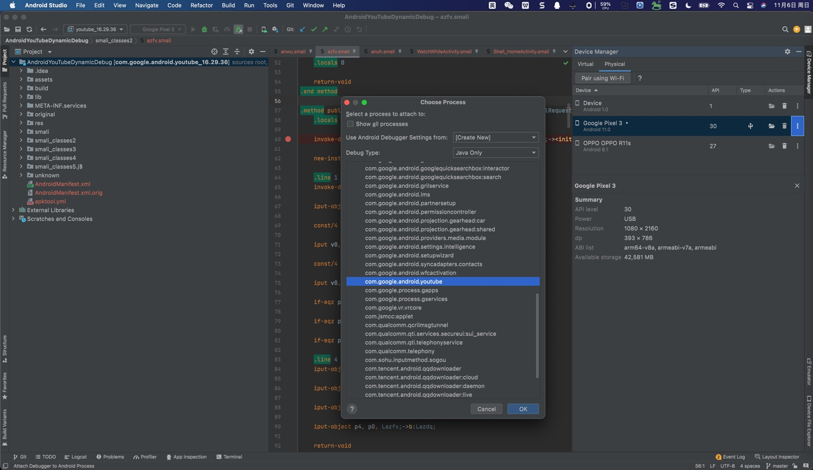
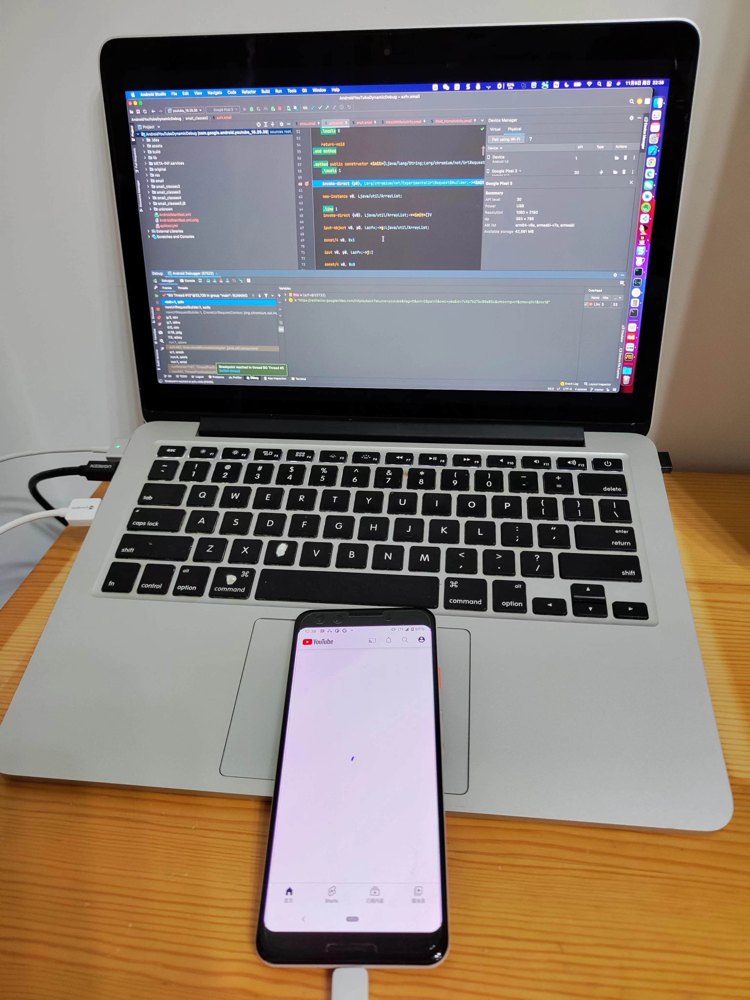
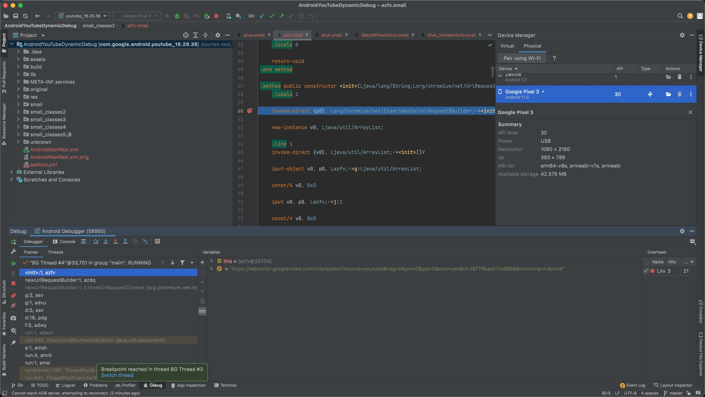

# AndroidYouTubeDynamicDebug=安卓YouTube动态调试

最后更新：`20221106`

## 项目源码

https://github.com/crifan/AndroidYouTubeDynamicDebug

`git clone https://github.com/crifan/AndroidYouTubeDynamicDebug.git`

## 项目功能

`Android Studio`去动态调试YouTube的项目源码

* == [apktool](https://book.crifan.org/books/android_re_repack_apk/website/repack_tool/apktool.html)反编译YouTube的apk得到的所有文件 + `.idea`文件夹（AS项目的配置）
* 属于[Android逆向](https://book.crifan.org/books/android_reverse_dev/website/)中的[动态调试](https://book.crifan.org/books/android_re_dynamic_debug/website/)的实际例子

## 使用说明

用`Android Studio`打开，去调试：

* `Attach Debugger to Android Process`
  * 

即可。

效果举例：

* 
  * 

具体所需环境和详细步骤，详见：

* [Android逆向：动态调试 crifan.org](https://book.crifan.org/books/android_re_dynamic_debug/website/)
